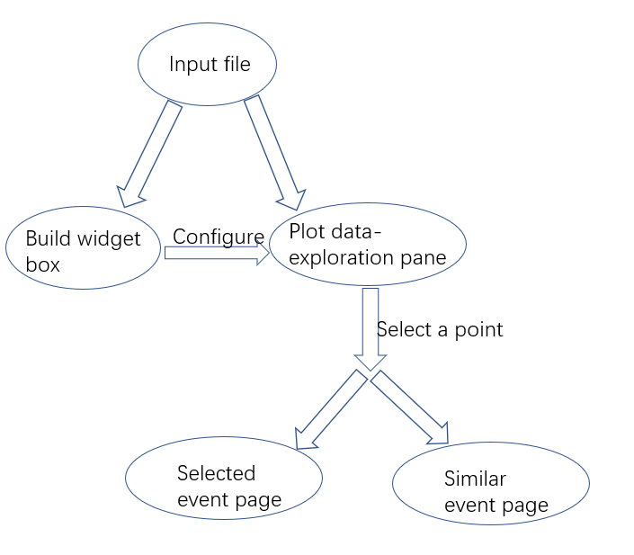

.. Smart Power Grid documentation master file, created by
   sphinx-quickstart on Thu Aug  3 19:20:26 2022.
   You can adapt this file completely to your liking, but it should at least
   contain the root `toctree` directive.

Welcome to Smart Power Grid's documentation!
============================================

Part one
-------------------------
*This part introduces a tool to classify power quality events according to IEEE standards.*

part two
-------------------------
*This part introduces A self-contained local web/browser-based application to view classifications from the classification tool/CNN model and assist subject matter experts (SMEs) to understand and label the event data.*
*Users have to use PyPI to install all the packages needed for part two before run it.*

You can see completed codes of part two here_.

.. _here: https://github.com/zzzzqi/2022-Power-Grids/blob/main/Production/client_demo/dashboard_demo.py/

The picture below shows the logic of part two.

The first part of the codes create the template of dashboard and the construction of sidebar.

Details of the all methods included are described below:

.. automodule:: dashboard_demo
   :members:
   :show-inheritance:

.. toctree::
   :maxdepth: 2
   :caption: Contents:

Indices and tables
==================

* :ref:`genindex`
* :ref:`modindex`
* :ref:`search`
